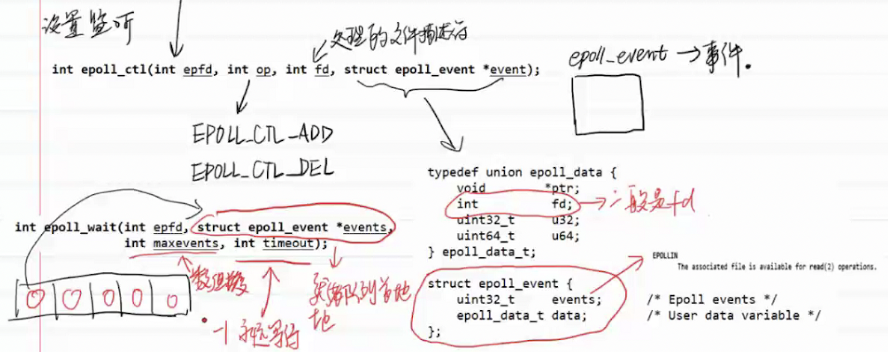
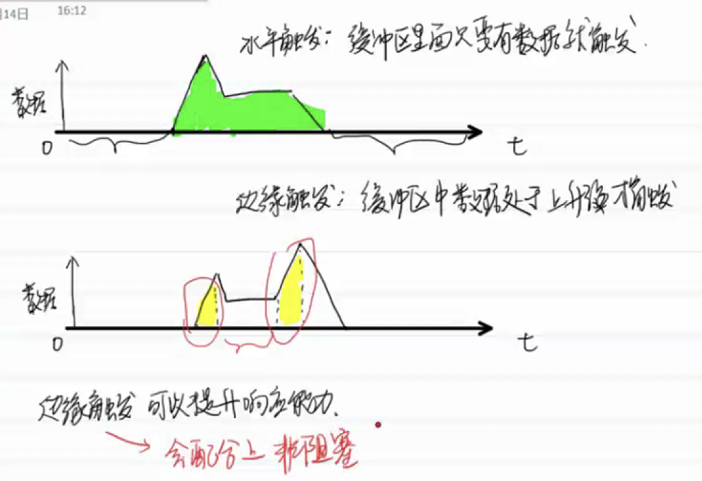

[TOC]


# Linux

## Linux知识

### CMake

cmake中的系统指令支持大小、小写和大小写混合

```cmake
cmake_minimum_required (VERSION 2.6)

# 本CMakeLists.txt的project名称
# 会自动创建两个变量，PROJECT_SOURCE_DIR 和 PROJECT_NAME
# ${PROJECT_SOURCE_DIR}：本CMakeLists.txt所在的文件夹路径
# ${PROJECT_NAME}：本CMakeLists.txt的project名称
project(xxx)

# 给文件名/路径名或其他字符串起别名，用${变量}获取变量内容
set(变量 文件名/路径/...)

# 添加编译宏,代码中可以读到这些宏 可以使用命令关闭或开启：cmake -Dxxxxx=on/off
add_definitions(-Dxxx)
add_compile_definitions(xxx)   # 这种方法不用加-D

#设置编译选项
  #单独设置C++或C的编译选项
set(CMAKE_CXX_FLAGS "${CMAKE_CXX_FLAGS} -Werror")
set(CMAKE_C_FLAGS "${CMAKE_C_FLAGS} -Werror")
  # 针对所有编译器设置编译选项
add_compile_options(-std=c++17)

#设置编译标准为c++17
set(CMAKE_CXX_STANDARD 17)

# 打印消息
message(消息)

# 添加一个子文件夹的CMakeLists.txt并构建
add_subdirectory(子文件夹名称)

# 将.cpp/.c/.cc文件生成.a静/动态库
# 注意，库文件名称通常为libxxx.so，在这里只要写xxx即可
add_library(库文件名称 STATIC 文件)
add_library(库文件名称 SHARED 文件)

# 将.cpp/.c/.cc文件生成可执行文件,即编译可执行文件
add_executable(可执行文件名称 文件)

# 将指定目录添加到编译器的头文件搜索路径之下，指定的目录被解释成当前源码路径的相对路径。非递归添加，仅那一级目录
include_directories(路径)

# 即可将指定目录设为头文件搜索路径，等价于系统路径，甚至可用<>引用头文件。更常用的是在库中将目录设为.  这样此库被其他cmakelists target_link_libraries时会继承库的搜索路径。public改为private则不会将搜索路径传播出去
target_include_directories(a.out PUBLIC 目录)

 # 指定链接库文件路径
target_link_directories(a.out PUBLIC 目录)

# 规定.so/.a库文件路径 相当于编译的时候加了-L xxx
link_directories(路径)

# 对add_library或add_executable生成的文件进行链接操作
# 注意，库文件名称通常为libxxx.so，在这里只要写xxx即可
target_link_libraries(编译工程名 链接的库文件名称)

# 搜索当前路径下的所有源代码文件并将列表存储到 xxx变量中
aux_source_directory(. xxx)

# 打印信息 
# (无) = 重要消息；
# STATUS = 非重要消息；
# WARNING = CMake 警告, 会继续执行；
# AUTHOR_WARNING = CMake 警告 (dev), 会继续执行；
# SEND_ERROR = CMake 错误, 继续执行，但是会跳过生成的步骤；
# FATAL_ERROR = CMake 错误, 终止所有处理过程；
message(STATUS "xxxx")

# 引用系统中预安装的第三方库
find_package(fmt REQUIRED)
target_link_libraries(myexec PUBLIC fmt::fmt)
# 指定要用其中的哪几个库
find_package(TBB REQUIRED COMPONENTS tbb tbbmalloc REQUIRED)
target_link_libraries(myexec PUBLIC TBB::tbb TBB::tbbmalloc)

```

`set(CMAKE_VERBOSE_MAKEFILE TRUE) ` 可以开启cmake的调测信息

<font size="5">**.cmake文件**</font>

相当于cmake的模块函数文件

```cmake
${CMAKE_CURRENT_LIST_DIR}  # 可获得该cmake文件的当前绝对路径
```


<font size="5">**编译流程：**</font>

```shell
mkdir build  # 为了将编译过程中生成的文件放到build路径下，不破坏源码的目录结构  
cd build
cmake ..  # 前三步可以简化成 cmake -B build
make
```

<font size="5">**list命令**</font>

对一个list进行多种操作

```cmake
list(LENGTH <list><output variable>)          # 返回list的长度
list(REMOVE_ITEM <list> <value>[<value> ...])   # 从list中删除某个element
list(APPEND <list><element> [<element> ...])    # 添加新element到list中
```

<font size="5">**file命令**</font>

收集文件

```cmake
file(GLOB_RECURSE <variable> 
     [<globbing-expressions>...])    # 递归收集globbing-expressins下的所有文件
```


### 编译工具GCC/G++

使用-c参数编译生成.o中间文件：`g++ -c xxx.cpp -o xxx.o`

### PATCH补丁命令

制作补丁：`diff text1.txt text2.txt > text.patch`  ，patch是基于diff出来的数据去打补丁的。

使用patch文件对源文件打补丁：`patch -p0 text1.txt text.patch`  ，打补丁完成后，text1.txt的内容则和text2.txt保持一致。

注意：patch时源文件同一行有修改，或patch里记录的行有修改会导致patch失败

**参数：**

* `-p0` 代表保存原始目录，不跳过任何目录
* `-R`  补丁回退，相当于text2.txt复原到text1.txt

### 磁盘IO

fflush将数据从用户缓冲区刷写到内核缓存区

fsync将内核缓存区数据刷写到磁盘，同步等磁盘写入完毕后才返回

### CGROUPS

> 参考资料：https://tech.meituan.com/2015/03/31/cgroups.html
>
> 红帽社区资料 https://access.redhat.com/documentation/zh-cn/red_hat_enterprise_linux/8/html/managing_monitoring_and_updating_the_kernel/what-kernel-resource-controllers-are_setting-limits-for-applications

cgroups 的全称是control groups，cgroups为每种可以控制的资源定义了一个子系统。是Linux内核提供的一种可以限制单个进程或者多个进程所使用资源的机制，可以对 cpu，内存等资源实现精细化的控制。典型的子系统介绍如下：1.cpu 子系统，主要限制进程的 cpu 使用率。2.cpuacct 子系统，可以统计 cgroups 中的进程的 cpu 使用报告。3.cpuset 子系统，可以为 cgroups 中的进程分配单独的 cpu 节点或者内存节点。4.memory 子系统，可以限制进程的 memory 使用量。5.blkio 子系统，可以限制进程的块设备 io。6.devices 子系统，可以控制进程能够访问某些设备，等等多个子系统功能。

<font size=5>**cpu子系统**</font>

* cpu.cfs_quota_us和cpu.cfs_period_us配合使用可限制cpu的绝对使用上限

<font size=5>**cgroups使用方法**</font>

cgroups通过VFS吧相关功能暴露给用户

* 创建cgroups层级结构

  cgroups其实就是个虚拟文件系统，通过cgroups文件系统来维护，因此使用的话需要先挂载cgroups文件系统，格式为: `mount -t cgroup -o subsystems name /cgroup/name`，其中 subsystems 表示需要挂载的 cgroups 子系统， /cgroup/name 表示挂载点，如上文所提，这条命令同时在内核中创建了一个cgroups 层级结构。比如挂载 cpuset, cpu, cpuacct, memory 4个subsystem到/cgroup/cpu_and_mem 目录下，就可以使用 `mount -t cgroup -o remount,cpu,cpuset,memory cpu_and_mem /cgroup/cpu_and_mem`

* 加入子节点和进程

  挂载某一个 cgroups 子系统到挂载点之后，就可以通过在挂载点下面建立文件夹或者使用cgcreate命令的方法创建 cgroups 层级结构中的节点。比如通过命令`cgcreate -t sankuai:sankuai -g cpu:test`就可以在 cpu 子系统下建立一个名为 test 的节点。然后可以通过写入需要的值到 test 下面的不同文件，来配置需要限制的资源。当需要删除某一个 cgroups 节点的时候，可以使用 cgdelete 命令，比如要删除上述的 test 节点，可以使用 `cgdelete -r cpu:test`命令进行删除。把进程加入到 cgroups 子节点也有多种方法，可以直接把 pid 写入到子节点下面的 task 文件中。也可以通过 cgclassify 添加进程，格式为 `cgclassify -g subsystems:path_to_cgroup pidlist`


### VIM

三种模式：

* 正常模式

  默认模式，打开文档进入此模式，删除、上下左右移动光标等等，可以使用快捷键

  快捷键：

  ```
  :tabnew filname 多标签
  gt：切换到下一个标签
  gT：切换到上一个标签
  :jumps  查看jumplist
  插入模式键入Ctrl-o，则回到命令模式，执行一条命令后重新进入编辑模式
  :%s/old/new/g 可以替换 old 为 new（%表示从第一行到最后一行）（g：此行中的全部匹配项）（不加/g：此行中第一个匹配项）
  :#,#s/old/new/g ：在两行内替换所有的字符串 old 为新的字符串 new
  在命令行模式中粘贴y复制的内容(粘贴0号寄存器中的内容)：/ + ctrl + r + 0
  
  h、j、k、l：右、下、左、上。H：屏幕第一个字符，L：屏幕最后一行的第一个字符
  w、b、e：跳到下个单词词首、跳到本单词或上个单词词首、跳到本单词或下个单词词尾
  gg：跳到第一行，G：跳到最后一行，5G：跳到第五行
  v：进入行可视模式，类似于鼠标选取
  ctrl + v：进入列选择模式
  批量添加注释：进入列选择并选中列之后，I 加 // 加 esc
  自动对齐代码：v选择范围 加 = 即可
  对全文对齐：gg到文件开头 加 = 加 G
  viw：选中当前单词
  vi(tag)：如vi{：选中{}中间的内容
  #,*：向前、向后查找光标所在关键字
  %：匹配对应的括号
  拷贝当前行：yy，拷贝当前行向下的5行：5yy，粘贴：p
  删除当前行：dd，删除当前行向下的5行：5dd
  x：删除光标所在字符
  r：替换光标所在字符
  R：连续替换光标所在字符
  删除类操作符d：
  dw：删除内容直到后一个单词的起始处（d为操作符，w为动作）
  d$：删除内容直到行末
  dtf：向后删除到f
  dff：向前删除到f
  更改类操作符c：
  cw：删除内容直到后一个单词的起始处并进入插入模式
  cl：删除光标字符并进入插入模式
  在文件中查找某个词：/xxx , 跳到下一个匹配目标：n,上一个：N
  :set hls ：高亮显示所有查找内容。:nohlsearch ：移除高亮显示
  
  :! ：后接外部命令可以执行外部命令
  设置文件行号：:set nu， 取消行号：:set nonu
  ctrl + g：查看当前行及文件信息
  :sp 上下分屏
  :vsp 左右分屏
  ctrl + w ctrl + w：在窗口之间切换
  ctrl + d：查看可选的命令补全
  到达最后一行：G，到达首行：gg
  到达某一行：行号+G
  0：移动到行首
  撤销动作：u
  U：撤销在这一行所做的所有动作
  反撤销：ctrl + R
  移动到20行：
  	1.显示行号：:set nu
  	2.输入： 20
  	3.输入： G
  :w TEST：该命令会以 TEST 为文件名保存整个文件
  :r FILENAME ：将FILENAME内的内容插入光标所在行
  :r !ls ：将ls命令的结果插入到光标所在行
  寄存器：
  "" 存储dcy等操作的数据
  "0 存储y过来的数据
  
  :%!xxd 查看二进制文件
  
  ```

  

* **插入/编辑模式**

  输入i：会跳到光标的前面，I：跳到行首

  输入a：会跳到光标的后面，A：跳到行尾

  输入o：另起下一行，O：另起上一行

  输入r：输入一个字符取代当前字符

* **命令行模式**

  保存、退出、读取等等

  ```
  :wq  保存并退出
  :q  退出
  :q! 不保存强制退出
  ```

* 三种模式的转换：

  * 命令行/插入模式--->正常模式模式  `esc`
  * 正常模式--->插入模式  `i`
  * 正常模式--->命令行模式 `:`或者 `/`

* vimdiff

  vimdiff a.txt b.txt对比两个文件的不同 

**批量替换**

```shell
:let i=0|g/\(asd\)[0-9]/s//\=submatch(1).i/|let i=i+1   #将文中出现的所有asd数字替换为asd数字（数字从0开始，每次递增1）
```

参考文献： http://blog.itpub.net/25897606/viewspace-746838/  

需要对匹配内容的值做数值计算需要使用`\=submatch(1)`形式获得匹配的内容

将匹配到的内容作为后续替换时的输入：

将后续需要使用到的内容用括号括入，在替换内容部分使用`\1`、`\2`等代表第一个、第二个括号中的内容，eg：`:%s/\(.*FileSize=\)/\1111/g` 将FileSize=后的内容替换为111

参考文献：https://vim.fandom.com/wiki/Search_and_replace

<font color=red>注意：</font>vim中使用正则表达式的元字符时，除了.*$^这类常用的之外，其他元字符需要使用\进行转义

### 正则表达式

排除某个字符：`[^A]`

\s元字符：它表示匹配任意空白字符（包括空格、制表符、换行符等）。

\d元字符：匹配所有数字

### GDB指南

* 编译和gdb运行二进制文件环境不一致导致无法查看源文件 **set substitute-path**

  当带符号表的二进制文件编译出来放到另一个地方跑的时候，用list列出源文件的时候会提示找不到源文件，可以看到提示的路径还是旧的、编译的是文件路径，而在运行环境上想看源文件需把源文件拷到运行环境，并使用`set substitute-path from_path to_path`将gdb搜索的目录替换，比如 list显示的源码是  /home/aaa/1.cpp，那么设置了 `set substitute-path /home/aaa/  /home/bbb/`，之后，即使你的源文件1.cpp 放在 /home/bbb下面也是可以找到的了。因为gdb帮你做了字符串替换。

调试正在运行的程序：gdb {program} {pid}，或在gdb里执行attach {pid}命令

**gdb命令**

* `p $_siginfo` 打印接收到的信号的详细信息，例如：si_code表示信号产生的方式，si_pid表示发送信号的进程  相关信息可以看siginfo.h源码

调试正在运行的程序：`gdb {program} {pid}` 或 `gdb -p {pid}`

查看信息 info，缩写 i

* info proc mapping  查看进程地址映射信息
* info locals  查看栈帧变量
* 查看寄存器：`i registers` ，查看所有寄存器 `i all-registers`

常规

* 需要提前使用gcc的-g参数得到编译后的可执行文件，此文件包含调试信息（优化等级调为0）

* `gdb 待调试文件`：进入调试

* `set args xxx xxx`：设置命令行参数

* `list/l`：列出带行号的源代码

  `list show`：列出show函数源代码

  `list main.c:10`：列出main.c的第十行源代码

* `run/r`：运行程序，停在断点位置

* `start`：直接开始调试，相当于在main的第一行设置了断点

* `n/next`：下一条指令，会越过函数

* `s/step`：下一条指令，会进入函数

* `q`：退出gdb

* 后台( 异步 )执行调试命令  `command&` command可选：run,attach,step,stepi,next,nexti, continue, finish, until

* 查看当前栈的汇编指令：`disassemble`


断点

普通断点 break、观察断点watch和捕捉断点

* `b 行号`：在行号处设置断点， 后可以添加条件使得满足条件才停下（条件断点）
* `b 行号 if xxx`：设置条件断点 
* `disable`：使断点暂时失效
* `enable`：让断点重新生效
* `d 行号`：删除断点 
* `continue/c`：执行到下一个断点，无断点则执行完整个程序
* `finish`：结束当前函数调用，跳到函数调用入口
* `until`：跳出代码循环体

查看变量

* `p/print 变量`：查看变量的值

* `p $_siginfo` 打印接收到的信号的详细信息，例如：si_code表示信号产生的方式，si_pid表示发送信号的进程  相关信息可以看siginfo.h源码

* `display 变量`：设置跟踪变量

* `undisplay 编号`：取消跟踪变量

* `ptype`：查看变量类型

* `x`：查看内存

  `x /12tb arr`：表示以arr为首地址，查看12个字节，以二进制显示

  * t 按二进制格式显示变量。c 按字符显示变量
  * b 表示单字节

* `bt/backtrace`和`frame`

  当在一个函数中想查看不在当前函数作用域的变量时，可切换到变量所在栈帧来查看

  * `bt`：显示当前程序的栈帧
  * `frame 栈帧编号`：切换当前的栈环境为指定编号栈帧
  * `thread apply all bt`：打印所有线程的栈帧

多进程/多文件

* `b 函数名/ b 文件名:行号`：对指定的函数或源文件打断点
* tb ：临时断点，只生效一次 
* `set follow-fork-mode parent/child`：只调试父/子进程

<font size="5">**gdb文件查看源码**</font>

* 编译和gdb运行二进制文件环境不一致导致无法查看源文件 **set substitute-path**

  当带符号表的二进制文件编译出来放到另一个地方跑的时候，用list列出源文件的时候会提示找不到源文件，可以看到提示的路径还是旧的、编译的是文件路径，而在运行环境上想看源文件需把源文件拷到运行环境，并使用`set substitute-path from_path to_path`将gdb搜索的目录替换，比如 list显示的源码是  /home/aaa/1.cpp，那么设置了 `set substitute-path /home/aaa/  /home/bbb/`，之后，即使你的源文件1.cpp 放在 /home/bbb下面也是可以找到的了。因为gdb帮你做了字符串替换。

杂项

* shell：跳到shell执行shell命令，再键入exit退回到gdb

### GCC/G++编译

<font size="5">**编译参数**</font>

* `-Wl,--no-as-needed xxxx`   强制链接动态库
* `-Wl,--as-needed`      忽略链接时没有用到的静态库，链接器默认使用此参数
* `tui enable`或者`layout src`可以打开源代码的UI界面辅助查看，`layout asm`将代码以汇编的形式呈现
* gdb脚本：`save breakpoints xxx`保存当前断点到脚本中，脚本可以通过`source xxx`读取，读取后将顺序执行脚本中的命令

## Perf性能分析工具

### perf

Perf工作模式分为Counting Mode和Sampling Mode，Counting Mode将会精确统计一段时间内CPU相关硬件计数器数值的变化，为了统计用户感兴趣的事件，Perf Tool将设置性能控制相关的寄存器，这些寄存器的值将在监控周期结束后被读出，典型工具Perf Stat；Sampling Mode将以定期采样方式获取性能数据，PMU计数器将为某些特定事件配置溢出周期，当计数器溢出时，相关数据如 IP、通用寄存器、EFLAG 将会被捕捉到，典型工具Perf Record。

<font size=5>**perf stat**</font>

可以整体看看程序运行是各种统计时间的大概情况。**Perf stat通过概括精简的方式提供被调试程序运行的整体情况和汇总数据**。

* 使用方法

  ```shell
   perf stat ./excutbleFile  #停止后即可显示统计结果。可通过-r参数指定重复执行次数
   perf stat -p $pid -d     #进程级别统计
   perf stat -a -d sleep 5  #系统整体统计
   perf stat -p $pid -e 'syscalls:sys_enter' sleep 10  #分析进程调用系统调用的情形
   perf stat -a sleep 5 #收集整个系统的性能计数，持续5秒
   perf stat -C 0  #统计CPU 0的信息
  ```

  显示结果各字段意义：

  - task-clock：CPU利用率，此值越高说明程序的多数时间花费在CPU计算上而非IO，任务真正占用的处理器时间，单位为ms
  - CPUs utilized ： task-clock/time elapsed (CPU的占用率)
  - context-swichees：程序在运行过程中的上下文切换次数
  - page-faults:缺失异常的次数。当应用程序请求的页面尚未建立，请求的页面不在内存中，或者请求的页面虽然在内存中，但物理地址和虚拟地址的映射关系尚未建立时，都会触发一次缺页异常。另外TLB不命中，页面访问权限不匹配等情况也会触发缺页异常。
  - context-switches：进程切换次数，记录程序运行过程中发生了多少次进程切换，频繁的进程切换是应该避免的；（应该是上下文切换吧？）
  - cache-misses：程序运行过程中总体的cache利用情况，如果该值过高，说明程序的cache利用不好；
  - CPU-migrations：表示进程t1运行过程中发生了多少次CPU迁移，即被调度器从一个CPU转移到另外一个CPU上运行；
  - cycles：处理器时钟，一条指令可能需要多个cycles；
  - instructions:执行了多少条指令。
  - IPC：instructions/cycles的比值，该值越大越好，说明程序充分利用了处理器的特性；IPC为平均每个cpu cycle执行了多少条指令。
  - cache-references：cache命中的次数；
  - cache-misses：cache失效的次数；

  通过-e选项，可以改变perf stat的缺省事件(perf list查看)，perf stat -h查看帮助信息。

<font size=5>**perf top**</font>

**用于实时统计当前系统的性能信息。**

可通过-e参数列出其他时间的TopN进程/函数，比如-e cache-miss，用于查看谁造成的cache miss最多（-e 可用参数可使用perf list查看）

* 使用方法

  ```shell
  perf top  #查看所有进程
  perf top -p $pid  #进程级别   -g 可列出详细信息
  ...
  ```

在**perf top界面按h键可以唤起帮助菜单**

<font size=5>**perf record/report**</font>

使用perf top和perf stat之后，对系统性能已经有了一个大致的了解，下面就需要进一步分析更细粒度的信息。**perf record记录单个函数级别的统计信息，并使用perf report来显示统计结果**。

* 使用方法

  ```shell
  perf record -p $pid
  perf record -p $pid -g  #详细采用，配合perf report -g使用   不加-g貌似只能以线程为粒度采集
  perf record -e cpu-clock ./$excutbleFile
  
  perf report $file   #查看统计信息
  perf report -g $file   #查看信息统计信息
  ```

<font size=5>**perf script**</font>

读取Perf record结果

<font size="5">**perf list**</font>

查看当前支持的所有事件包含硬件事件，软件事件，硬件cache事件，PMU事件以及预设Tracepoint事件

### apt包管理

下载包：`apt-get install -d <软件包>`

下载包所在目录：/var/cache/apt/archives/

### 同步异步、阻塞非阻塞

阻塞和非阻塞指的是：当前接口数据还未准备就绪时，线程是否被阻塞挂起。
同步和异步是指：当前请求是否有结果

### 环境变量相关知识

首先要认识几个和环境变量有关的文件：

- /etc/profile —— 此文件为系统的每个用户设置环境信息,当用户第一次登录时,该文件被执行.并从/etc/profile.d目录的配置文件中搜集shell的设置；
- /etc/environment —— 在登录时操作系统使用的第二个文件,系统在读取你自己的profile前,设置环境文件的环境变量；
- /etc/bashrc —— 为每一个运行bash shell的用户执行此文件.当bash shell被打开时,该文件被读取；
- ~/.profile —— 每个用户都可使用该文件输入专用于自己使用的shell信息，当用户登录时，该文件仅仅执行一次！默认情况下,它设置一些环境变量,执行用户的.bashrc文件；
- ~/.bashrc —— 该文件包含专用于你的bash shell的bash信息,当登录时以及每次打开新的shell时,该文件被读取；

<font size=5>进程使用的环境变量</font>

进程使用的环境变量可以通过`cat /proc/进程pid/environ`查看

### Socket知识

查询系统socket缓存区大小：`cat /proc/sys/net/ipv4/tcp_rmem`。查询出来的三列分别为最小、默认、最大缓存区字节数。

函数原型：`int socket(int domain, int type, int protocol);`

#### domain参数

AF_UNIX：代表本地连接

## Linux C++ 系统编程

##### 磁盘刷新、同步（sync、fsync、fdatasync）

* sync

  sync函数只是将所有修改过的块缓冲区排入写队列，然后就返回，它并不等待实际写磁盘操作结束。通常称为update的系统守护进程会周期性地（一般每隔30秒）调用sync函数。这就保证了定期冲洗内核的块缓冲区。命令sync(1)也调用sync函数。

* fsync

  fsync函数只对由文件描述符filedes指定的单一文件起作用，并且**阻塞等待写磁盘操作结束，然后返回**。

* fdatasync

  fdatasync函数类似于fsync，但它只影响文件的数据部分。而除数据外，fsync还会同步更新文件的属性。

  fdatasync函数类似于fsync，但它只影响文件的数据部分。而除数据外，fsync还会同步更新文件的属性。

##### epoll

新的I/O多路复用机制，使用回调机制代替SELECT的轮询机制，epoll的数据结构在内核态，是一个文件对象（包含了一个监听集合和就绪队列，其中监听集合用红黑树实现，目的是为了更好更快的管理文件描述符）

将就绪队列拷到用户态后再遍历就绪队列

**SELECT的不足：**

1. 用户态拷贝到内核态（大量对监听集合对拷贝）
2. 文件集合大小固定（用位图来保存）
3. 就绪机制不合理（特别是有海量连接但是少量就绪时）

**epoll的不同：**

1. 把监听和就绪分离
2. 把监听集合放内核态，不用在循环中重复设置监听集合
3. 就绪的只在就绪队列

* **epoll_create函数**

  创建一个epoll文件对象参数填大于0到数即可

  注意结束要close

* **epoll_ctl函数**

  设置监听

  struct epoll_event对应一个事件

  *epoll_ctl和struct epoll_event结构体：*

  events代表读或写事件

  

* **epoll_wait函数**

  ```c
  // epfd：   events：就绪队列数组，提前定义好  maxevents：最大就绪个数。 timeout超时时间，单位是ms,-1是永久等待
  int epoll_wait(int epfd, struct epoll_event *events, int maxevents, int timeout);
  // 返回就绪事件个数
  ```

* **epoll的边缘触发**

  有颜色则代表可以触发，epoll_wait在events参数中设置EPOLLET表示监听为边缘触发

  水平触发（默认）和边缘触发(EPOLLET)

  

* **epoll的一个例子**

  ```c++
  #include <sys/epoll.h>
  // 1.先用epoll_create创建一个epoll
  		int epfd = epoll_create(1);
  // 2.用epoll_ctl添加监视，需要提前写好struct epoll_event结构体
      struct epoll_event event;
      event.data.fd = sockFd;
      event.events = EPOLLIN;    // 边缘触发可在这里用 | 添加 ，默认为水平触发
      epoll_ctl(epfd, EPOLL_CTL_ADD, sockFd, &event);  // 监视sockFd
  // 3.使用epoll_wait阻塞进程，需提前创建一个readyQueue数组，用来存放就绪队列
      // 创建就绪队列
      struct epoll_event readyQueue[MAXNUM];    // MAXNUM为就绪队列最大长度
  		// 阻塞并开始监听
  		int readyNum = epoll_wait(epfd, readyQueue, MAXNUM, 5000);
  // 4.用for循环遍历就绪队列readyQueue，并设置对应的行为
          for(int i = 0; i < readyNum; ++i){
            if(readyQueue[i].data.fd == ...){
  						.....
          	}else if(){
  						.....
           	}
          }
  ```


##### inotify

事件触发的磁盘监控

主要涉及三个函数：

* Iinotify_init函数

  ```c++
  int inotify_init(void);   // 初始化inotify文件
  int inotify_init1(int flags);    // 带参数的初始化，如IN_NONBLOCK 非阻塞
  ```

* inotify_add_watch函数

  ```c++
  int inotify_add_watch(int fd, const char *pathname, uint32_t mask);  // 添加需要监控的文件、目录  fd为inotify_init得到的fd
  ```

* inotify_rm_watch函数

  移除监控

<font size=4>示例</font>

```c++
/* 初始化inotify */
    int notifyFd = inotify_init1(IN_NONBLOCK);
    unordered_map<int, string> wdFilePathMap;   // 保存wd监控描述符和监控的文件路径的对应关系
    if (notifyFd == -1) {
        P_LOG.error("inotify_init1 failed!");
    }
    int wd = inotify_add_watch(notifyFd, "/root/workSpace/testCode/build", IN_CREATE | IN_DELETE);   // 监控创建和删除文件操作
    wdFilePathMap[wd] = "/root/workSpace/testCode/build";
    

/* 处理监控的文件操作 */
    char buf[4096];   // 保存notifyFd内保存的具体操作信息
    int len = 0;
    const struct inotify_event *event;    // 保存具体的一个事件内容
    while (len = read(notifyFd, buf, sizeof(buf))) {   // 读取notifyFd中保存的事件信息到buf
        if (len <= 0) {
            break;
        }
      	// 将buf中的内容转换为inotify_event类型并进行处理
        for (char *ptr = buf; ptr < buf + len; ptr += sizeof(struct inotify_event) + event->len) { 
            event = (const struct inotify_event *) ptr;
            if (event->mask & IN_CREATE) {
                P_LOG.info("IN_CREATE: %s/%s", wdFilePathMap[event->wd].data(), event->name);
            }
            if (event->mask & IN_DELETE) {
                P_LOG.info("IN_DELETE: %s/%s", wdFilePathMap[event->wd].data(), event->name);
            }
        }
    }
```

##### 线程

linux下获取线程号的两种方式：

```c++
syscall(SYS_gettid);    // 返回的是linux系统中该线程所属的标识号
pthread_self();      // 返回的是pthread库中标记的线程号，与linux中的不一致，和pthread_create获取的一致。
```


## Linux常用命令

* `unrar x 文件名`：解压rar压缩的文件
  x为全路径解压，在指定解压路径时会把压缩前的路径一起解压出来
  e为无路径解压，即在指定解压路径时会把所有文件解压到指定路径，不保存原来的目录结构，即全部文件都堆在指定目录里
  参考资料：https://www.lanqiao.cn/questions/985/

* `rpm2cpio xxx.rpm | cpio -div` 将rpm包解压解压到当前目录

* `rpm -ivh xxx` 安装rpm包

* `pgrep -f {name}`   根据进程名获取pid

* `pidstat -d 1` 监控进程磁盘读写占用情况

* `w` 查看终端用户，`pkill -t pts/1` 提出对应终端的用户   踢用户利器!

* 以xx用户身份执行命令

  `runuser -l xx -c "command"` 执行路径会在该用户的家目录下

  `su - xxx -c "commad"`   和runuser一致

  `su - xxx`  切换到xxx用户，如果在脚本中使用，该句后面的命令依旧是以原来的用户权限运行

* `mount -o remount,rw,exec /`  给根目录添加读写、可执行权限

* mv命令

  mv在同一个分区之内是执行的rename的操作，不会更改inode节点的信息，rename是原子操作，可以看成一瞬间就能完成。而如果跨分区进行mv 的话，就需要对文件进行复制+修改文件属性，涉及的时间就会比同分区mv大大加长，实际的inode也会发生改变。

* ps

  `ps -T -p $pid` 查看所有线程

* top

  `top -H -p ${pid}` 查看这个进程的所有线程占用cpu大小

* `hexdump`：以x进制方式查看文件

* `c++filt _ZN1N1C4FuncEi`  查看符号表中的函数名， 配合`typeid(xxx).name()`可以查看一个变量的类型

* 创建一个socket，并作为一个服务端等待客户连接

  `nc -U /xxxx -l`  -U 告诉nc使用UnixSocket文件，-l告诉nc作为一个服务端 默认为TCP类型

  -u 使用UDP

* 查看进程与文件的关系 `lsof`

  用lsof | grep 进程名可以看到进程使用了哪些文件


* AWK使用

  语法：`awk 'pattern{action}' 文件名`

  <font size="5">pattern用来设定条件</font>

  例如  `awk ''$1>1{print $1}''` 筛选第一列大于1的行

  pattern里可以修改某一列的值

  <font size="5">action用来指定动作</font>

  * print 打印动作

  可以有多个action，以;分隔

  action中使用if的案例：`awk '{if($4) {$4*=$3;$3=1;print} else {print}}' asyslog.conf`  根据$4存不存在走不同分支

  变量：

  * -v ORS="xxx" 保存输出记录分隔符
  * -v FS="xxx"  自定义分隔符
  * NR 当前行号
  * NF 总列数，$NF代表最后一列

  去重： `awk '!a[$0]++' 原文件 > 目的文件`

  BEGIN{...}、END{...}在读取文件之前/后执行

* SED使用

  语法 `sed [-hnV] [script] [文件名]`

  -i：表示直接修改文件

  -e：多点编辑，即-e后接script，并可接多个-e，顺序执行

  -n：表示仅显示script处理后的结果

  **动作说明：（在script中使用）**

  - a ：新增， a 的后面可以接字串，而这些字串会在新的一行出现(目前的下一行)～
  - c ：取代， c 的后面可以接字串，这些字串可以取代 n1,n2 之间的行！
  - d ：删除，因为是删除啊，所以 d 后面通常不接任何东东；
  - i ：插入， i 的后面可以接字串，而这些字串会在新的一行出现(目前的上一行)；
  - p ：打印，亦即将某个选择的数据印出。通常 p 会与参数 sed -n 一起运行～
  - s ：取代，可以直接进行取代的工作哩！通常这个 s 的动作可以搭配正则表达式！例如 1,20s/old/new/g 就是啦！

* SHELL使用

  shell脚本中设置的环境变量只对shell脚本本身及其子shell有效，对其父shell和其他shell无效

  **shell变量**

  ```shell
  $!  # 获取shell运行的后台程序的pid
  $?  # 获取shell中上一条指令的退出状态码
      #   0	命令成功结束
      #   1	一般性未知错误
      #   2	不适合的shell指令
      
  # 定义变量 变量加减
  num=1
  let num+=1
  
  # 获取上条指令的运行结果
  pid=`pidof xxx`
  ```

  **循环语句**

  ```shell
  while ((i <= 100))
  do
      sum += i
      ((i++))
  done
  ```

  ##### 判断语句

  ```shell
  # 数值判断
  value=0
  if [ $? -eq $value ];then
          sleep 5
          command
  else
          sleep 1
          command
  fi
  
  ```

  

  shell中常用的 set命令

  设置flag，用来触发某一效果

  `set -` 恢复默认设置

  `set -x` 输出每一句执行的命令到stderr里面

  `set +o noclobber`   防止使用> 重定向

  

* diff命令

  diff正常格式  略

  diff上下文格式  `diff -c`   ，会分别显示出各个文件不同行的上下文

  diff合并格式 `diff -u `     git diff使用的风格

* 添加用户

  `useradd 用户名 -m`：不指定组的话会默认创建一个同名的组并加入。/home目录下会对应创建一个用户文件夹

  `useradd -d 指定路径 用户名`：创建用户名且指定该用户文件名和文件所在位置

  `useradd -g 用户组 用户名`：创建用户并添加到用户组

  添加系统用户用adduser，如果用useradd将创建一个三无用户
  添加sudo权限：在/etc/sudoers 的`root ALL=(ALL:ALL) ALL`这一行下增加`用户名 ALL=(ALL:ALL) ALL `即可

* 修改系统时间

  `date -s 16:40:30`

* grep

  grep搜索当前路径下文件中的文本内容：`grep xxx -r .`    -n：输出行号。-i：忽略大小写

  输出上下文：`-C 5` 输出匹配位置的上下5行。`-B 5` 输出匹配位置前5行。`-A 5` 输出匹配位置后5行。

* 查看二进制文件链接到哪些动态库及其路径

  `ldd xxx`

* netstat

  `netstat -tunlp`  查看进程监听的端口

* 磁盘相关

  查看磁盘挂载数据：df -h

  查看指定目录所占磁盘空间：`du -sh 目录` -s表示只显示结果

  查看目录下各个文件的大小：`du -ah --max-depth=1 目录名`
  
  *参数：*
  
  * `-s`：指定目录占用大小汇总
  * `-h`：带计量单位
  * `-a`：含文件
  * `-c`：列出明细的同时，增加汇总值
  * `--max-depth=x`：指定子目录深度为x
  
  `dd if=/dev/zero of=test.txt count=10 bs=1M`  创建大小为10M的文件
  
  `dd if=/dev/urandom bs=1 count=64`     需要创建大文件用来输入的话可从/dev/urandom文件方便的读取随机数据
  
* **-exec / -ok / xargs**

  `find ./ -maxdepth 1 -type f -exec rm -r {} \;`：将前面find指令的结果传给后面的{}然后执行后面的指令。将前面的命令分段依次传给后面的命令，传一个执行一次命令。

  `find ./ -maxdepth 1 -type f -ok rm -r {} \;`：将前面find指令的结果传给后面的{}然后执行后面的指令，会让你确认是否删除

  `find ./ -maxdepth 1 -type f | xargs  rm -r `：将前面find指令的结果传给后面，然后执行后面的指令,当结果集过大时会分段 ，因此比-exec优越，但xargs命令对传过来的结果集默认以空格分割，因此如果一个文件名中有空格，如：abc dd，那么xargs会把这一个文件看成两个文件：abc和dd，解决办法是两个命令都加上-print0：以null分割结果集。xargs将前面的内容作为参数传给后续命令执行，而不是文本内容。将前面命令一股脑的甩给后面的命令作为参数，只执行一次后面的命令。
  
* `crontab -e` 编辑定时任务

#### 查看二进制文件

* `readelf -s xxx` 读取二进制文件符号（如果符号太长会被截断）
* `objdump -T xxx` 显示二进制文件符号

## linux杂项知识

#### 动态库优先搜索路径：

```shell
export LD_LIBRARY_PATH=自己的动态链接库路径:$LD_LIBRARY_PATH
```

/etc/ld.so.conf文件内记录了要搜索库的路径，使用ldconfig会搜索这些路径，并将文件加载到ld.so.cache内

去除export过的环境变量：`unset LD_LIBRARY_PATH`

##### 系统默认编辑器修改

`update-alternatives --config editor` 修改系统默认编辑器

**命令行操作**

* ctrl+a  跳到开头
* ctrl+e 跳到结尾
* ctrl+w 删除光标前一个单词

#### date

`date +%Y-%m-%d' '%H:%M:%S.%N`  打印时间，精确到纳秒

#### Linux用户权限（UID）

* RUID：实际用户ID

* EUID：有效用户ID

  通常情况下等于RUID

* SUID：设置用户ID

  跟文件绑定而不是更用户绑定

以passwd程序为例：通过ll查看passwd二进制的权限可以看到有s位，此位即说明SUID位，passwd修改的是/etc/shadow文件，而此文件的属性为 644 root:root，说明非root用户是无法写此文件的，运行有SUID位的进程会让此进程的属主变成其二进制的属主，相当于提权操作。

#### 秘钥生成

`ssh-keygen` 一路回车，生成秘钥对

将公钥放到机器的~/.ssh/authorized_keys文件下
